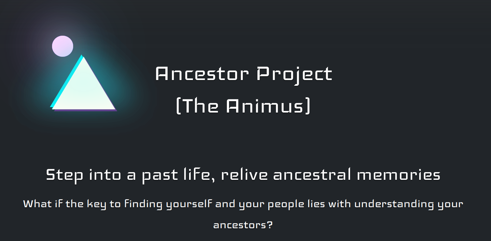

# 🏛️ Ancestor Project (The Animus)

> **Step into a past life, relive ancestral memories**

An interactive AI-powered simulation inspired by Assassin's Creed's Animus, where you explore your ancestor's story through an engaging narrative experience. Make choices that shape the course of history and discover your family's past.



## ✨ Features

- 🤖 **AI-Powered Storytelling**: Dynamic narratives generated by Google's Gemini AI
- 🎮 **Interactive Choices**: Make decisions that influence your ancestor's journey
- 📖 **Immersive Experience**: Rich, historical storytelling with branching narratives
- 🔄 **Session Management**: Secure, persistent story progression
- ⚡ **Real-time Updates**: Live story updates using Server-Sent Events
- 🎨 **Modern UI**: Beautiful, responsive interface with dark theme
- 🛡️ **Security**: Rate limiting, input validation, and secure session handling

## 🚀 Quick Start

### Prerequisites

- **Python 3.12+**
- **Google Gemini API Key** ([Get one here](https://aistudio.google.com/apikey))
- **uv package manager** ([Install here](https://docs.astral.sh/uv/getting-started/installation/))

### Installation

1. **Clone the repository**
   ```bash
   git clone <repository-url>
   cd ancestry-project
   ```

2. **Set up environment variables**
   ```bash
   # Create .env file
   touch .env
   ```
   
   Add your configuration:
   ```env
   GEMINI_API_KEY=your_gemini_api_key_here
   SECRET_KEY=your_secret_key_here
   ```
   
   **Generate a secret key:**
   ```bash
   python3 -c 'import secrets; print(secrets.token_hex())'
   ```

3. **Install and run the application**

   **Optionally: Using uv sync first**
   ```bash
   uv sync
   uv run main.py
   ```

4. **Run the application**
   ```bash
   uv run main.py
   ```

5. **Open your browser**
   Navigate to [http://localhost:5000](http://localhost:5000)

## 🎯 How It Works

### 1. **Questionnaire Phase**
- Enter your interest in ancestry exploration
- Optionally provide an ancestor's name and birth date
- Set the stage for your historical journey

### 2. **Simulation Phase**
- AI generates an immersive story based on your interests
- Make critical choices that shape the narrative
- Experience up to 3 major decision points
- Watch your ancestor's story unfold in real-time

### 3. **Story Completion**
- After 3 choices, the simulation concludes
- Reflect on your ancestor's journey
- Start a new simulation to explore different paths

## 🛠️ Technology Stack

| Component | Technology | Purpose |
|-----------|------------|---------|
| **Backend** | Quart | Web framework |
| **AI** | Google Gemini 2.0 Flash | Story generation |
| **Frontend** | Bootstrap 5.3 | UI framework |
| **Real-time** | Server-Sent Events | Live updates |
| **Styling** | Custom CSS + Iceland font | Visual design |
| **Package Manager** | uv | Dependency management |

## 📁 Project Structure

```
ancestry-project/
├── app.py                 # Main Quart application
├── main.py               # Application entry point
├── pyproject.toml        # Project configuration
├── .env                  # Environment variables
├── templates/
│   ├── base.html         # Base template
│   ├── questionnaire.html # Initial form
│   └── simulation.html   # Story interface
└── README.md            # This file
```

## 🔧 Configuration

### Environment Variables

| Variable | Description | Required |
|----------|-------------|----------|
| `GEMINI_API_KEY` | Your Google Gemini API key | ✅ Yes |
| `SECRET_KEY` | Quart session secret key | ✅ Yes |
| `PORT` | Server port (default: 5000) | ❌ No |
| `HOST` | Server host (default: 127.0.0.1) | ❌ No |
| `FLASK_ENV` | Set to 'development' for debug mode | ❌ No |

### Customization

**Change the AI Model:**
```python
# In app.py, line ~110
model = genai.GenerativeModel("gemini-2.5-flash")  # Change model here
```

**Modify Story Length:**
```python
# In app.py, SYSTEM_PROMPT
# Adjust the number of choices allowed
```

## 🎮 Usage Examples

### Example Session Flow

1. **Start**: Visit the homepage and click "Start your simulation"
2. **Questionnaire**: 
   - Interest: "I want to explore my ancestor's role in the American Civil War"
   - Ancestor: "John Smith"
   - Birth Date: "1835-06-15"
3. **Simulation**: Make choices like:
   - "A) Join the Union Army"
   - "B) Stay home and protect the family"
   - "C) Work as a medic"
4. **Story**: Watch as your choices create a unique narrative

## 🔒 Security Features

- **Rate Limiting**: 30 requests per minute per IP
- **Input Validation**: Sanitized user inputs
- **Session Security**: HTTP-only cookies, SameSite protection
- **Error Handling**: Graceful error management
- **Logging**: Comprehensive activity logging

## 🐛 Troubleshooting

### Common Issues

**Port Already in Use**
```bash
# macOS: AirPlay uses port 5000 by default
PORT=8000 uv run main.py
```

**API Key Issues**
```bash
# Verify your .env file exists and contains:
GEMINI_API_KEY=your_actual_key_here
SECRET_KEY=your_generated_secret_here
```

**Dependencies Not Found**
```bash
# Reinstall dependencies
uv sync --reinstall
```

### Debug Mode

Enable debug mode for development:
```bash
FLASK_ENV=development uv run main.py
```

## 🤝 Contributing

1. Fork the repository
2. Create a feature branch (`git checkout -b feature/amazing-feature`)
3. Commit your changes (`git commit -m 'Add amazing feature'`)
4. Push to the branch (`git push origin feature/amazing-feature`)
5. Open a Pull Request

## 📄 License

This project is licensed under the MIT License - see the [LICENSE.md](LICENSE.md) file for details.

## 🙏 Acknowledgments

- **Assassin's Creed** for the Animus concept inspiration
- **Google Gemini** for AI storytelling capabilities
- **Flask** for the web framework
- **Bootstrap** for the beautiful UI components

## 📞 Support

If you encounter any issues or have questions:

1. Check the [troubleshooting section](#-troubleshooting)
2. Review the [configuration options](#-configuration)
3. Open an issue on GitHub

---

**Ready to explore your ancestry?** 🏛️✨

Start your journey at [http://localhost:5000](http://localhost:5000) and discover the stories that shaped your family's past.